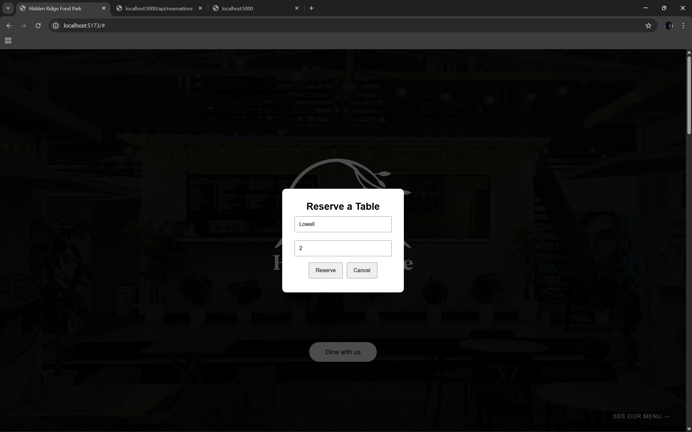
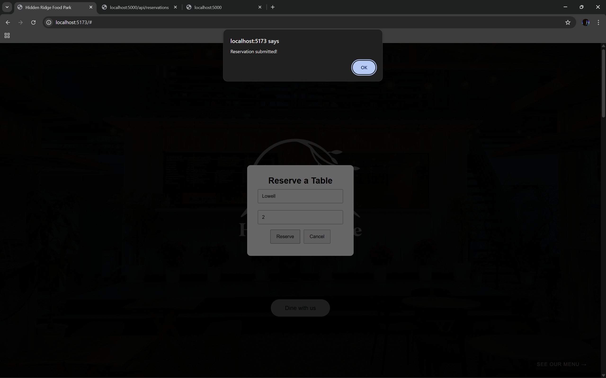
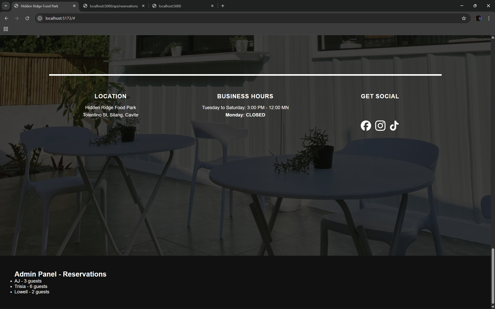
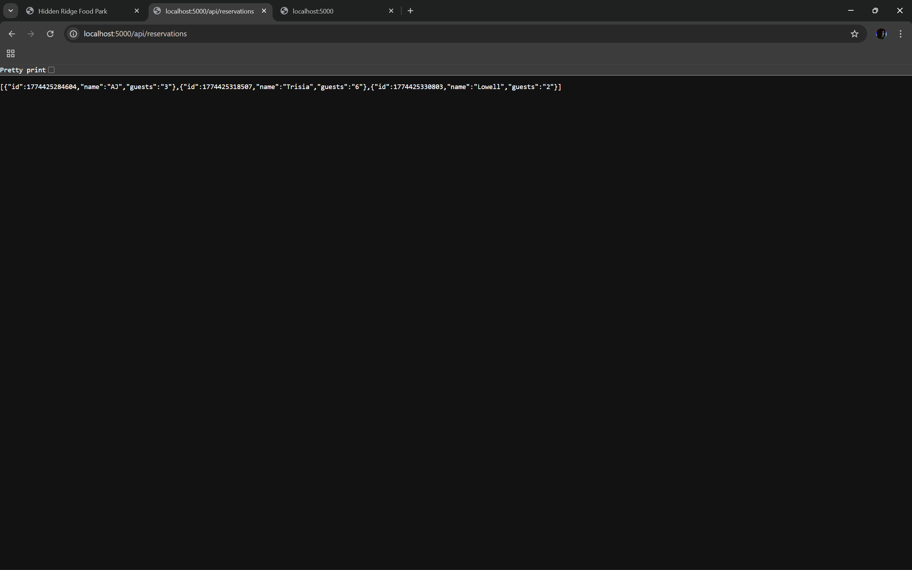

# 🚀 Hidden Ridge Food Park (Full-Stack Upgrade)

This project was originally built using **HTML, CSS, and JavaScript**, and was later upgraded into a full-stack web application using **React (Vite)** and **Node.js (Express)**.

---

## 🔧 Features

- Modern React frontend powered by Vite  
- Responsive UI with reusable components  
- Dynamic rendering of food stalls using mapped data  
- Table reservation system with modal form  
- REST API integration using Express.js  
- Admin panel to view submitted reservations  
- Smooth scrolling and improved user interaction
- Interactive hover effects on food stall cards with subtle scaling for improved user experience

---

## ⚙️ Tech Stack

- **Frontend:** React.js (Vite), CSS  
- **Backend:** Node.js, Express.js  
- **API:** RESTful API (GET & POST)  
- **Tools:** Git, GitHub  

---

## 📌 Key Learnings

- Transitioned from static website to full-stack architecture  
- Implemented client-server communication using fetch API  
- Managed state and user input using React hooks  
- Built and consumed REST APIs  
- Structured a scalable project with separate frontend and backend  

---

## 🖼️ Screenshots

### Homepage


### Reservation Modal


### Reservation Form (Input)


### Reservation Confirmation


### Cafe Section


### Food Stalls Section (Part 1)


### Food Stalls Section (Part 2)


### End Section


### Admin Panel


### API Reservations (JSON Data)


---

## 🚧 Future Plans

- Add clickable food stall cards that open a modal displaying the stall’s full menu and prices  
- Improve UI/UX with animations and transitions for modals and page elements  
- Expand admin panel with features such as deleting or managing reservations  
- Add form validation and error handling for reservation inputs  
- Enhance backend with database integration (e.g., MongoDB or PostgreSQL) instead of in-memory storage  
- Improve responsiveness and accessibility across devices  
- Potential deployment of the full-stack application (frontend + backend)

---

## 🎨 Design & Development Process

- Layout and visual structure were prototyped in **Canva** to plan spacing, alignment, and visual hierarchy.  
- The Cafe Section was redesigned using **CSS-rendered text overlay** on a full-background image for sharper, scalable, and more readable text.  
- Built with **HTML and CSS** for structure and styling.  
- Implemented interactivity using **JavaScript event handling** and smooth scrolling.  
- Transitioned into a **React (Vite) + Node.js full-stack application**, enabling dynamic UI and backend integration.  
- **AI-assisted development tools** were used to support debugging, layout refinement, and workflow efficiency.

---

## 🖥️ How to Run the Project

### 1. Clone the repository
```bash
git clone https://github.com/SE-Looweh05/Hidden-Ridge-Food-Park-Website.git
```

### 2. Navigate into the project folder
```bash
cd Hidden-Ridge-Food-Park-Website
```

### ▶️ Frontend Setup (React + Vite)
### 3. Install dependencies
```bash
npm install
```

### 4. Run the development server
```bash
npm run dev
```

### Then open the URL shown in the terminal (usually):
```bash
http://localhost:5173
```

---

### ⚙️ Backend Setup (Node + Express)

If your backend is inside a separate folder (e.g. backend):

### 1. Navigate to backend
```bash
cd backend
```

### 2. Install dependencies
```bash
npm install
```

### 3. Start the server
```bash
node server.js
```

### Backend usually runs on:
```bash
http://localhost:5000
```

### 🔗 API Endpoint Example
- GET /api/reservations
- POST /api/reservations

### Example response:
```bash
[
  {"id":1774425284604,"name":"AJ","guests":"3"},
  {"id":1774425318507,"name":"Trisia","guests":"6"},
  {"id":1774425330803,"name":"Lowell","guests":"2"}
]
```

### 📁 Project Structure
```bash
Hidden-Ridge-Food-Park-Website/
├── screenshots/
├── src/
├── backend/
├── index.html
├── package.json
└── README.md
```
