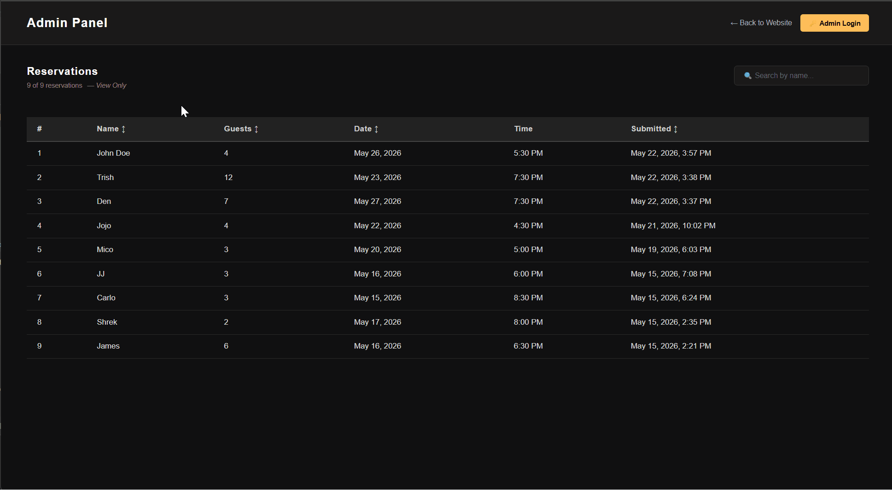
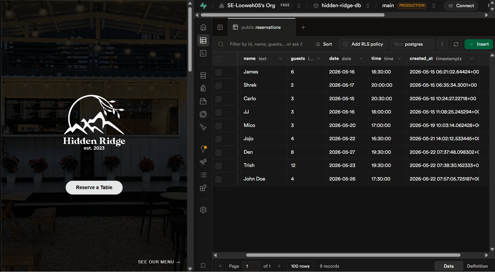

# 🍽️ Hidden Ridge Food Park (Full-Stack Web App)

A full-stack food park reservation system with admin dashboard, authentication, and business logic enforcement.  
Originally built as a static HTML/CSS/JS project and progressively upgraded into a production-style full-stack application.

---

## 🚀 Live Demo

- **Website:** [hidden-ridge-food-park-website.vercel.app](https://hidden-ridge-food-park-website.vercel.app)
- **Admin Panel:** [hidden-ridge-food-park-website.vercel.app/admin](https://hidden-ridge-food-park-website.vercel.app/admin)

---

## 🎬 Demo

### Reservation System (User Flow)


### Admin Panel (CRUD + Auth)


### Live Database Sync


### UI/UX Experience


---

## 🔥 Features

### Core System
- Full-stack reservation system (Create, Read, Update, Delete)
- JWT authentication with protected admin dashboard
- Business rules enforcement:
  - Tue–Sun, 3:00 PM–9:00 PM booking window
  - Monday fully blocked
  - Same-day bookings require +2 hour lead time
- Rate limiting (3 reservations per IP/hour)
- Real-time PostgreSQL sync via Supabase

### 📧 Email Confirmation System
- Automated reservation confirmation emails using the Resend API
- Styled HTML email template with reservation details and Hidden Ridge branding
- Guest email storage integrated into Supabase, admin table, and CSV export
- Production-ready implementation with support for custom domain email delivery

### Admin Panel
- Public view-only access to reservations
- Admin-only edit and delete functionality
- Search reservations by name (real-time)
- Sort by name, guests, reservation date, or created_at
- CSV export (admin-only)

### User Experience
- Reservation confirmation modal
- Toast notifications for form errors (auto-dismiss)
- Error modal for failed requests / rate limits
- Fully responsive UI (desktop, tablet, mobile)
- Smooth animations and transitions

---

## ⚙️ System & Architecture

- REST API (GET, POST, PUT, DELETE)
- Input validation and error handling middleware
- Supabase PostgreSQL database integration
- JWT-based authentication (backend secured)
- Session persistence using localStorage
- Environment variables for sensitive data
- Supabase keep-alive system (prevents free-tier sleep)
- Deployed on Vercel (frontend) and Render (backend)

---

## 🧠 Key Learnings

- Built and deployed a full-stack application end-to-end
- Designed REST API with authentication and middleware
- Implemented real-world business logic constraints
- Integrated PostgreSQL (Supabase) with backend API
- Managed client-server communication using Fetch API
- Built secure admin authentication system using JWT
- Applied rate limiting and request protection strategies
- Learned production deployment workflow (Vercel + Render)

---

## 🚧 Future Improvements

- Clickable food stall cards with full menu and price modal
- Improved mobile UX for browsing stalls
- Reservation conflict detection (prevent double booking same time slot)
- Reservation cancellation system for guests (cancel via unique link)
- Admin dashboard with reservation statistics (total guests, peak hours, busiest days)
- Pagination or infinite scroll for admin panel with large reservation lists
- Dark/light mode toggle for the main website
- Gallery section showcasing food park photos and ambiance

---

## 🖥️ How to Run

### Clone the repository
```bash
git clone https://github.com/SE-Looweh05/Hidden-Ridge-Food-Park-Website.git
cd Hidden-Ridge-Food-Park-Website
```

### ▶️ Frontend
```bash
npm install
npm run dev
```
Opens at: `http://localhost:5173`

### ⚙️ Backend
```bash
cd backend
npm install
node server.js
```
Runs at: `http://localhost:5000`

### 🔑 Environment Variables
Create a `.env` file inside `frontend/`:
```
VITE_BACKEND_URL=http://localhost:5000
```
Create a `.env` file inside your `backend/` folder:
```
DATABASE_URL=your_supabase_connection_string
ADMIN_PASSWORD=your_admin_password
JWT_SECRET=your_jwt_secret
```

---

## 🔗 API Endpoints

| Method | Endpoint | Description |
|--------|----------|-------------|
| GET | /api/reservations | Fetch all reservations |
| POST | /api/reservations | Add a new reservation (rate limited) |
| PUT | /api/reservations/:id | Edit a reservation (JWT protected) |
| DELETE | /api/reservations/:id | Delete a reservation (JWT protected) |
| POST | /api/admin/login | Admin login — returns JWT token |

---

## 📁 Project Structure

```
Hidden-Ridge-Food-Park-Website/
├── gifs/
├── screenshots/
├── frontend/
│   ├── public/
│   ├── src/
│   │   ├── App.jsx
│   │   ├── AdminPanel.jsx
│   │   ├── main.jsx
│   │   └── style.css
│   ├── vercel.json
│   └── .env
├── backend/
│   ├── server.js
│   ├── package.json
│   └── .env
├── .gitignore
└── README.md
```

---

## 🎨 Design & Development Process

- Layout prototyped in **Canva** and **Adobe Photoshop** for spacing and visual hierarchy
- Cafe section uses CSS text overlay on a full-background image
- Transitioned from static HTML/CSS/JS → React (Vite) + Node.js
- Database upgraded from in-memory storage → live Supabase PostgreSQL
- Reservation system upgraded with date/time picker, business hours validation,
  confirmation modal, toast notifications, and error modal
- Scroll system rebuilt from standard scrolling → custom parallax fade using
  `window.scrollY` and fixed CSS layers
- Admin panel separated into its own route via React Router DOM
- Deployed to Vercel + Render for full production availability
- AI-assisted tools used for debugging and workflow efficiency
