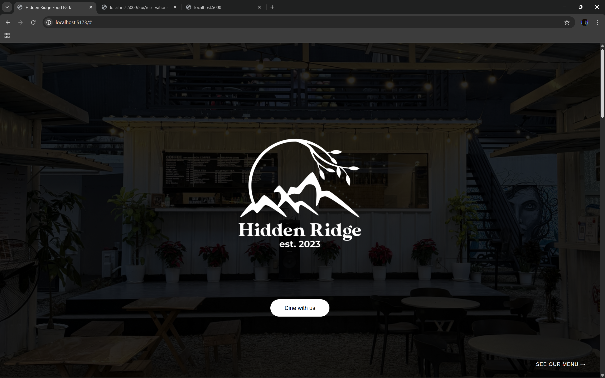
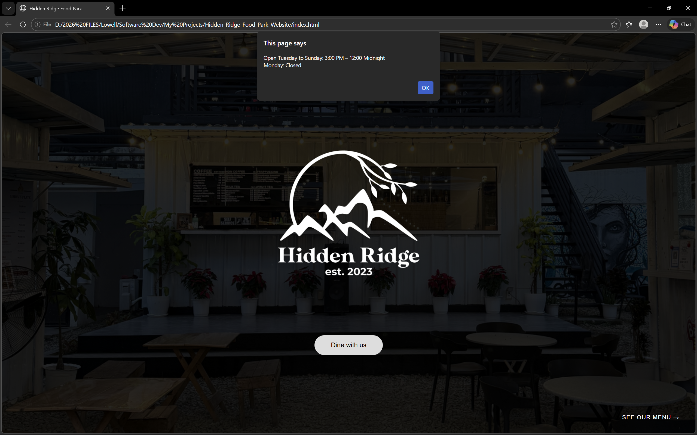
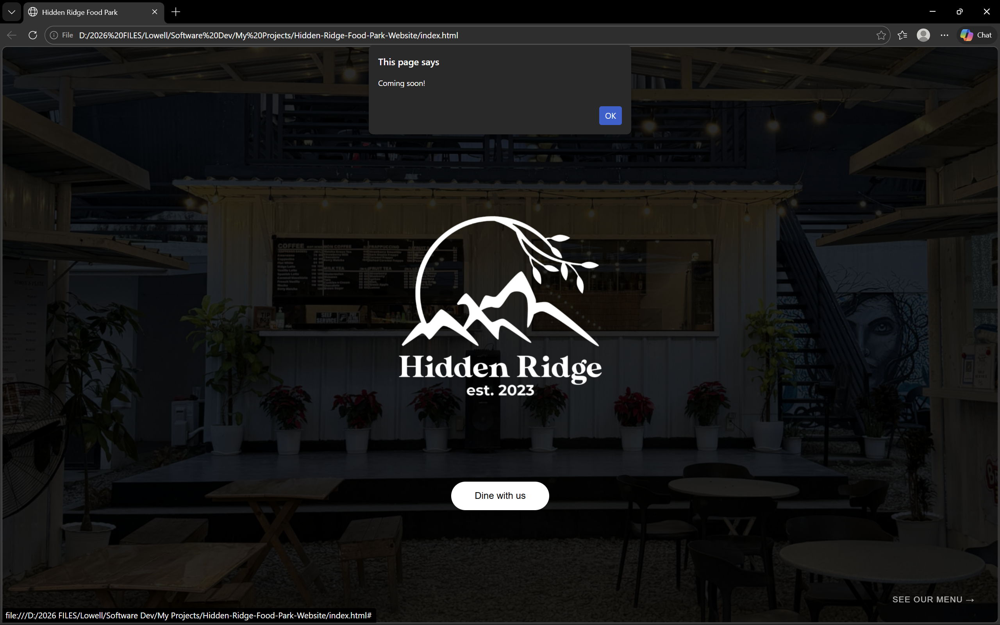

# Hidden Ridge Food Park Website

A simple, interactive website for Hidden Ridge Food Park built using HTML, CSS, and JavaScript.

This project demonstrates basic front-end structure, UI layout implementation, and JavaScript-based interactivity.

---

## Current Interactivity

- **"Dine with us" button**: Displays a popup showing the food park’s operating hours.
- **"See our menu" button**: Displays a popup message indicating the menu is coming soon.
- Buttons respond instantly to user interaction using JavaScript event handling.

---

## Screenshots

### Homepage


### "Dine with us" Button Popup


### "See our menu" Button Popup


---

## Design & Development Process

The website layout and visual structure were first prototyped using Canva to plan spacing, alignment, and visual hierarchy before implementation.

The design was then developed using HTML and CSS for structure and styling, while JavaScript was used to implement event-driven interactivity and user feedback through popups.

AI-assisted development tools were used as a coding aid to help with debugging, refining layout structure, and improving overall development workflow efficiency.

---

## How to Run

1. Clone the repository:
```bash
git clone https://github.com/SE-Looweh05/Hidden-Ridge-Food-Park-Website.git
