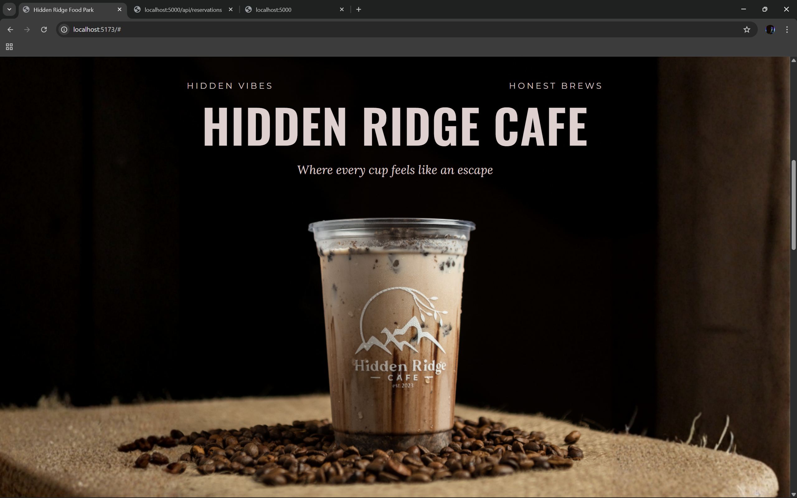
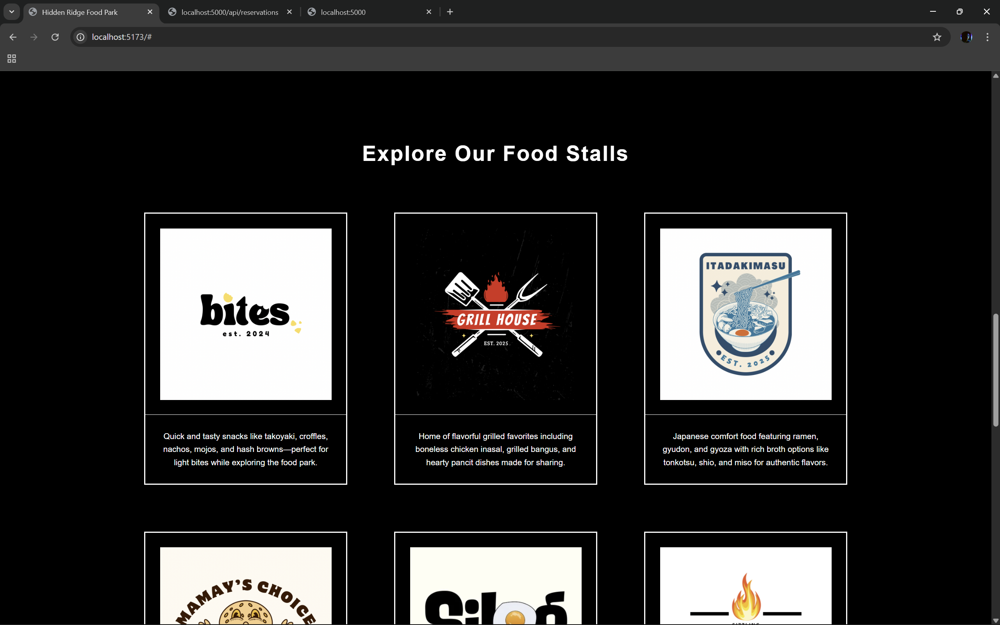
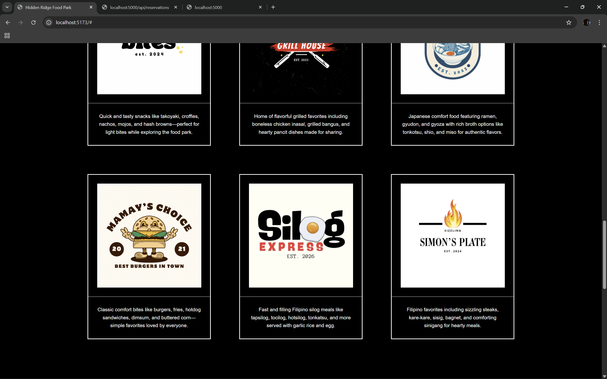
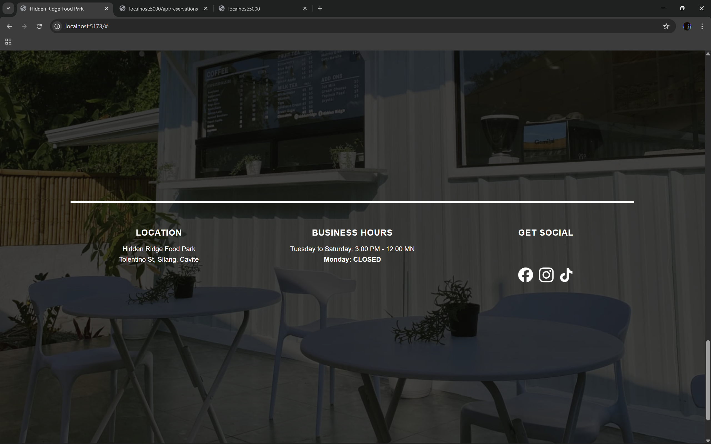

# Hidden Ridge Food Park Website

A simple, interactive website for Hidden Ridge Food Park built using **HTML, CSS, and JavaScript**.

This project demonstrates front-end structure, UI layout implementation, and JavaScript-based interactivity, including a multi-section layout with hero, cafe, food stalls, and end sections.

---

## Current Interactivity

- **"Dine with us" button:** Displays a popup showing the food park’s operating hours.  
- **"See our menu" button:** Smoothly scrolls the page to the food stalls section.  
- Hovering over food stall cards slightly enlarges the card for a visual effect.  
- Buttons respond instantly to user interaction using JavaScript event handling.

---

## Website Sections

### Hero Section
- Features the Hidden Ridge logo and main call-to-action buttons.

### Cafe Section (Updated)
- Replaced old two-column layout with a single full-background image (`cafe-bg.png`) that fills the entire section.  
- Added separate, CSS-rendered text overlay instead of text embedded in the image.  
- Text overlay includes:
  - **HIDDEN VIBES (left):** Montserrat, 18.3px  
  - **HONEST BREWS (right):** Montserrat, 18.3px  
  - **HIDDEN RIDGE CAFE (center):** Oswald, 100px  
  - **Where every cup feels like an escape (center below title):** Lora, 25.6px, italic  
- Text color updated to **light red `#e3cfcf`** with subtle text-shadow for readability.  
- Responsive positioning and scalable overlay for all screen sizes.

### Food Stalls Section
- Six portrait-style stall cards showing logo and description; three per row.  
- Responsive spacing across devices.

### End Section
- Background image, horizontal separator line, and three columns showing location, business hours, and social media.

---

## Screenshots

### Homepage


### Cafe Section (Updated)


### Food Stalls Section (Part 1)


### Food Stalls Section (Part 2)


### End Section


---

## Design & Development Process

- Layout and visual structure prototyped in **Canva** to plan spacing, alignment, and visual hierarchy.  
- Cafe Section redesigned using **CSS-rendered text overlay** on a full-background image for sharper, flexible, and readable text.  
- HTML and CSS used for structure and styling.  
- JavaScript used for event-driven interactivity and smooth scrolling.  
- **AI-assisted development tools** helped with debugging, layout refinement, and workflow efficiency.

---

## How to Run

Clone the repository:

```bash
git clone https://github.com/SE-Looweh05/Hidden-Ridge-Food-Park-Website.git
